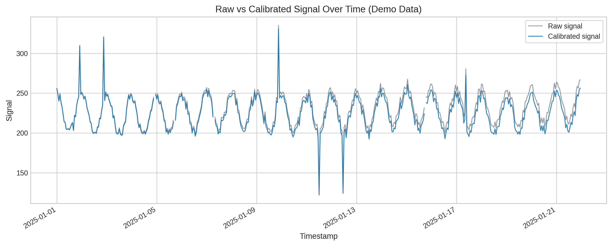
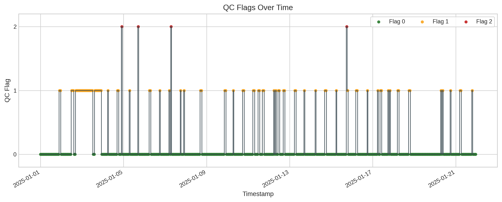
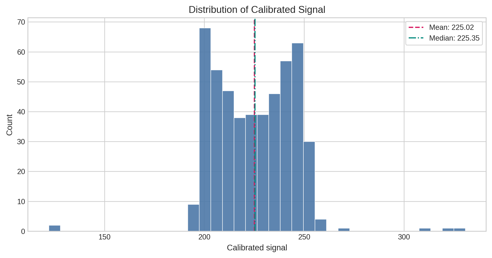

# Atmospheric Instrument Data Quality Pipeline


## Elevator Pitch
A reproducible Python pipeline for atmospheric measurements that demonstrates instrument-focused QA/QC, calibration correction, and traceable data processing from raw sensor records to analysis-ready outputs.

## Relevance to Atmospheric Measurement Workflows
This project mirrors common atmospheric instrument operations: field data acquisition from time-series sensors, application of calibration corrections, rule-based quality control and flagging, reproducible processing steps, and diagnostic visualization for technical review. The implementation is intentionally transparent so scientists and instrument engineers can inspect assumptions, thresholds, and outputs.

## Typical Instrument Data Workflow
Raw sensor data
↓

Ingestion
↓

Calibration
↓

Quality Control
↓

Flagging
↓

Analysis-ready dataset
↓

Diagnostics


Atmospheric observations require strict QA/QC procedures because downstream interpretation depends on data integrity. Reproducible processing and explicit flagging are essential for scientific reliability, intercomparison, and long-term measurement value.

## Why This Project Matters
Atmospheric and environmental measurements are only useful if data quality is traceable and defensible. In practice, researchers need workflows that make calibration assumptions explicit, apply explainable QA/QC rules, and produce audit-ready outputs for downstream analysis and reporting. This project demonstrates those core practices in a compact, reusable format.

## Repository Structure
```text
atmospheric-instrument-qc/
├── config/                     # YAML configuration for paths and thresholds
├── data/
│   ├── raw/                    # Simulated input data
│   ├── interim/                # Ingestion and calibration outputs
│   └── processed/              # QC-annotated outputs
├── figures/                    # Publication-style diagnostic figures
├── notebooks/                  # Reserved for optional exploratory notebooks
├── src/atmospheric_instrument_qc/
│   ├── generate_demo_data.py   # Synthetic atmospheric sensor data generator
│   ├── ingest.py               # Data loading + validation
│   ├── calibration.py          # Config-driven calibration logic
│   ├── qc.py                   # Rule-based quality checks and flags
│   ├── visualization.py        # Figure generation
│   └── main.py                 # CLI entry point
├── tests/
├── requirements.txt
└── pyproject.toml
```

## Workflow Overview
The CLI supports both single-step execution and full pipeline runs:

1. `generate-demo-data`: create simulated atmospheric sensor data.
2. `ingest`: parse timestamps, validate schema, sort records, and report missing values.
3. `calibrate`: apply offset/scale calibration and optional drift correction.
4. `qc`: apply rule-based quality checks and assign flags/reasons.
5. `plot`: generate technical diagnostics.
6. `run-all`: execute all steps end-to-end.

## Data Description
The current dataset is **simulated demo data** (`data/raw/demo_sensor_data.csv`) and not observational field data.

Variables include:
- `timestamp`
- `raw_signal`
- `temperature_c`
- `pressure_hpa`
- `relative_humidity`

The synthetic series includes realistic temporal variability plus controlled anomalies: missing values, spikes/outliers, and slow instrument drift.

## Real Data Example
A small observational sample is included at `data/example_real/co2_sample.csv` using public NOAA Global Monitoring Laboratory (GML) Mauna Loa (MLO) hourly CO2 data.

Source:
- NOAA GML in-situ hourly CO2 data product: `co2_mlo_surface-insitu_1_ccgg_HourlyData.txt`
- Access path: https://gml.noaa.gov/aftp/data/trace_gases/co2/in-situ/surface/txt/co2_mlo_surface-insitu_1_ccgg_HourlyData.txt

This sample is included for demonstration only, showing how the repository can be adapted from synthetic development data to real atmospheric instrument measurements.

Example command:
```bash
python -m atmospheric_instrument_qc.load_real_example
```

## Calibration and QC Methodology
### Calibration
Calibration is configured in `config/config.yaml` and applied to `raw_signal` as:

`calibrated_signal = (raw_signal + offset) * scale_factor`

Optional drift correction subtracts a linear rate over elapsed time.

### QC Flagging
QC is transparent and rule-based with a three-level convention:
- `0`: good
- `1`: suspect
- `2`: invalid

Rules currently implemented:
- missing value check
- physical range check
- spike detection from sudden jumps
- suspect trend detection from rolling baseline slope

Each record receives:
- `qc_flag`
- `qc_reason` (human-readable trigger summary)

## Example Outputs and Figures
Pipeline outputs:
- `data/interim/demo_sensor_data_loaded.csv`
- `data/interim/demo_sensor_data_calibrated.csv`
- `data/processed/demo_sensor_data_qc.csv`

Generated figures:
- `figures/demo_raw_vs_calibrated_timeseries.png`
- `figures/demo_qc_flags_over_time.png`
- `figures/demo_calibrated_signal_distribution.png`

These figures support technical review of calibration impact, temporal QC behavior, and signal distribution characteristics.

## Example Diagnostics
### Raw vs Calibrated Time Series

This diagnostic compares instrument `raw_signal` and `calibrated_signal` through time to verify expected calibration behavior while preserving raw observations.

### QC Flags Over Time

This plot shows when samples are marked as good, suspect, or invalid, helping identify periods affected by spikes, trend issues, or missing data.

### Calibrated Signal Distribution

This histogram summarizes the calibrated signal range and central tendency, supporting quick checks for distribution shape and potential anomalies.

## Reproducibility
```bash
git clone https://github.com/<your-username>/atmospheric-instrument-qc.git
cd atmospheric-instrument-qc

python3 -m venv .venv
source .venv/bin/activate

pip install -r requirements.txt
pip install -e .

python -m atmospheric_instrument_qc.main run-all
```

Run individual steps:
```bash
python -m atmospheric_instrument_qc.main generate-demo-data
python -m atmospheric_instrument_qc.main ingest
python -m atmospheric_instrument_qc.main calibrate
python -m atmospheric_instrument_qc.main qc
python -m atmospheric_instrument_qc.main plot
```

Run lightweight tests:
```bash
python -m unittest discover -s tests -v
```

## Continuous Integration
This repository includes a minimal GitHub Actions workflow at `.github/workflows/tests.yml`.
On every push and pull request, GitHub Actions creates a Python 3.11 environment, installs the package, and runs the unit tests automatically.

## Limitations
- Current data is simulated and intended for workflow demonstration.
- QC thresholds are heuristic and not instrument-specific.
- Calibration model is intentionally simple and does not include full uncertainty propagation.
- The project currently focuses on one demo instrument stream.

## Future Improvements
- Support real observational datasets and metadata standards.
- Add unit/integration tests for each pipeline stage.
- Introduce uncertainty tracking and calibration diagnostics.
- Add time-gap QC checks and richer flag taxonomies.
- Export analysis-ready summary products (daily statistics, QC reports).
